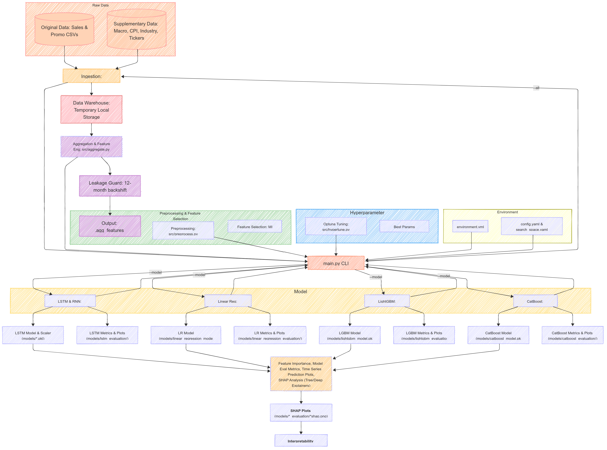

# Sales Data Analysis and Forecasting

An machine learning pipeline for sales forecasting and analysis with multiple model implementation options.

## Project Overview

This project implements a comprehensive sales forecasting system using both traditional machine learning and neural network approaches. The pipeline includes data ingestion, preprocessing, feature engineering, model training, hyperparameter optimization, and evaluation.

<div align="center">

### End-to-End Model Pipeline



</div>

## Key Features

- **Multiple Model Support**: Linear Regression, LightGBM, CatBoost, LSTM, and RNN
- **Consistent Target Variable Scaling**: Using MinMaxScaler to handle increasing sales trends
- **Hyperparameter Optimization**: Using Optuna for systematic parameter tuning
- **Feature Importance Analysis**: Permutation importance for feature selection
- **Time Series Cross-Validation**: To ensure robust model evaluation
- **Separate Preprocessing Flows**: Different approaches for traditional vs. neural network models
- **Command-Line Interface**: For targeted model training and evaluation
- **Visualization**: Model performance metrics and SHAP value plots

## Models

### Traditional Models
- **Linear Regression**: Simple baseline model
- **LightGBM**: Gradient boosting framework optimized for efficiency and performance. Especially useful for comprehensive inclusion of supplementary (macroeconomic) features, as boosted models support both efficiency and explainability.
- **CatBoost**: Gradient boosting with better handling of categorical features and strong support for supplementary features. These boosted models are ideal for extracting insights from macroeconomic variables and understanding their impact on sales.

**Note:** Boosted models (LightGBM, CatBoost) are particularly leveraged to include a wide range of supplementary and macroeconomic features, providing both high predictive power and interpretability. After training, the main trees of these models are fully plotted to facilitate easier navigation and deeper insights into feature importance and decision paths.

### Neural Network Models
- **LSTM**: Long Short-Term Memory networks for capturing temporal dependencies
- **RNN**: Recurrent Neural Networks for sequence modeling

## Installation

```bash
# Clone the repository
git clone https://github.com/Minh-Nguyen-0401/Business-Analytics-Assignment.git
cd Business-Analytics-Assignment

# Install dependencies
pip install -r requirements.txt
```

## Usage

### Command-Line Interface

The main script supports command-line arguments to run specific models:

```bash
# Run all models
python main.py

# Run a specific model with custom trial count
python main.py --model lightgbm --trials 100

# Available model options
python main.py --model [linear_regression|lightgbm|catboost|lstm|rnn]
```

### Model Evaluation

After training, model evaluation results are stored in the `models` directory:

```
models/
├── model_name_model.pkl            # Saved model
└── model_name_evaluation/          # Evaluation artifacts
    ├── metrics.json                # Performance metrics
    ├── actual_vs_predicted.png     # Visualization
    └── model_name_shap.png         # Feature importance
```

## How to Use This Repository

This repository is structured to facilitate a clear and reproducible machine learning workflow for sales forecasting. Here's a guide to the key components:

- **`main.py`**: The main entry point to run the entire modeling pipeline. You can specify which models to run and other parameters via command-line arguments (see [Command-Line Interface](#command-line-interface) section).
- **`src/`**: This directory houses the core Python modules for the project:
  - `ingest.py`: Handles loading of raw data.
  - `aggregate.py`: Performs feature aggregation and initial engineering.
  - `preprocess.py`: Contains logic for data cleaning, transformation, and feature scaling.
  - `hypertune.py`: Manages hyperparameter optimization using Optuna.
  - `train.py`: Implements the training and evaluation logic for all models.
  - `config.yaml`: Stores configuration parameters for the pipeline.
  - `search_space.yaml`: Defines hyperparameter search spaces for Optuna.
- **`utils/`**: Contains helper functions and utility scripts used across the project (e.g., `feature_generation.py`, `helper_func.py`).
- **`models/`**: After running the pipeline, this directory will store:
  - Trained model objects (e.g., `.pkl` files).
  - Evaluation artifacts for each model, including metrics (e.g., `metrics.json`), plots (e.g., `actual_vs_predicted.png`), and feature importance/SHAP value plots.
- **`original_data/` & `supplementary_data/`**: These folders should contain your input datasets. `original_data` is for primary sales and promotion data, while `supplementary_data` is for external data like macroeconomic indicators.
- **`forecast_25.ipynb`**: A Jupyter notebook dedicated to the 2025 sales forecast. It includes the specific implementation, analysis, and insights derived for this future period.
- **`EDA_compile.ipynb`** (to be added soon): This notebook will consolidate the complete Exploratory Data Analysis process, providing a comprehensive overview of data characteristics, patterns, and insights. *(Currently, `EDA_test.ipynb` contains preliminary EDA.)*
- **`pipeline_model_eval.md`**: A detailed markdown document explaining the end-to-end model preparation, construction pipeline, and evaluation results. Refer to this for an in-depth understanding of the methodology.
- **`log/`**: Stores log files generated during pipeline execution, useful for debugging and tracking.
- **`docs/`**: Contains any additional project documentation if any.

## Repository Structure

```text
.
├── .env                         
├── .gitignore                   
├── README.md                    
├── EDA_test.ipynb               
├── EDA_compile.ipynb            
├── forecast_25.ipynb            
├── pipeline_model_eval.md       
├── main.py                      
├── requirements.txt             
├── collect_macro_indicators.py  # Script to collect macroeconomic data
├── extract_cpi.py               # Script to extract CPI data
├── extract_inflation_rate.py    # Script to extract inflation rate data
│
├── docs/                        # Project documentation
├── img/                         # Images used in documentation (e.g., pipeline diagrams)
├── log/                         
├── models/                      
├── original_data/               
├── supplementary_data/          
│
├── src/                         
│   ├── __init__.py
│   ├── aggregate.py             # Feature aggregation and engineering
│   ├── config.yaml              # Pipeline configuration
│   ├── hypertune.py             # Hyperparameter tuning with Optuna
│   ├── hypertune_results.yaml   # Stores results from hyperparameter tuning
│   ├── ingest.py                # Data ingestion from raw sources
│   ├── preprocess.py            # Data preprocessing and transformation
│   ├── search_space.yaml        # Defines hyperparameter search spaces
│   └── train.py                 # Model training and evaluation
│
└── utils/                       
    ├── __init__.py
    ├── feature_generation.py    # Functions for creating new features
    └── helper_func.py           # General helper functions
```

## Implementation Details

See [**pipeline_model_eval.md**](./pipeline_model_eval.md) for a detailed explanation of the end-to-end model pipeline and evaluation results.