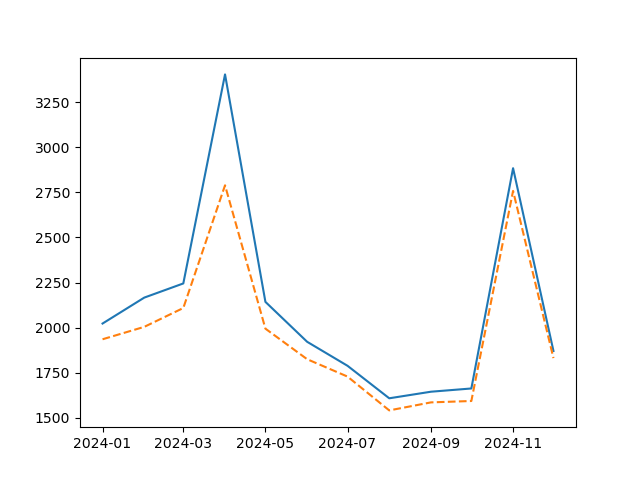
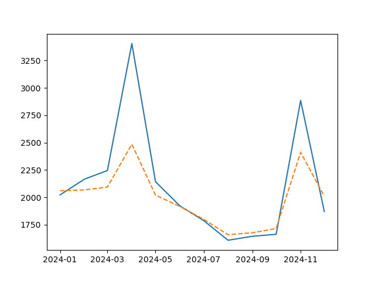
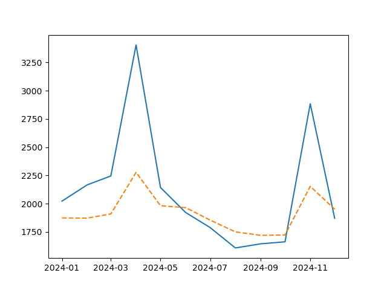
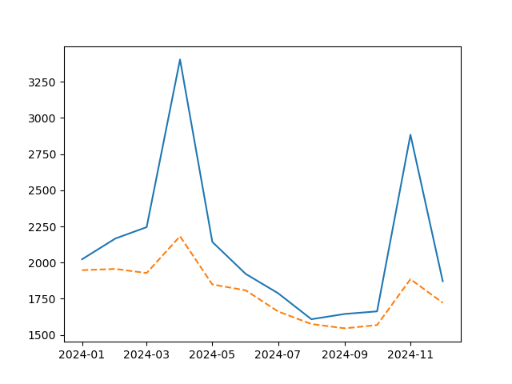
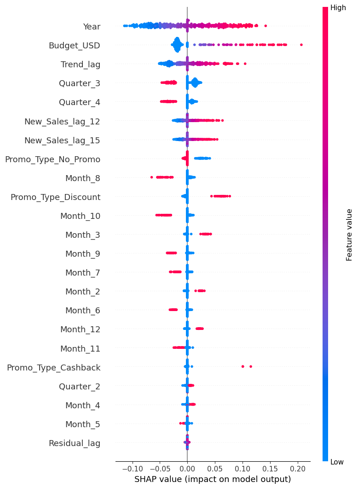

# Section A. End-to-End Sales Forecasting Model Preparation & Construction Pipeline

<div align="center">

## Pipeline Overview


</div>

## Table of Contents
1. Repository Structure
2. Data Collection & Preparation
3. Data Ingestion (`src/ingest.py`)
4. Aggregation & Feature Engineering (`src/aggregate.py`)
5. Preprocessing & Feature Selection (`src/preprocess.py`)
6. Hyperparameter Tuning (`src/hypertune.py`)
7. Model Training & Evaluation (`src/train.py`)
8. Main Pipeline Entrypoint (`main.py`)
9. Environment & Reproducibility

---

## 1. Repository Structure
<details>
<summary><strong>Directory Layout</strong></summary>

```
│   .env
│   .gitignore
│   collect_macro_indicators.py
│   EDA_test.ipynb
│   extract_cpi.py
│   extract_inflation_rate.py
│   forecast_25.ipynb
│   main.py
│   main_model.ipynb
│   main_test.py
│   pipeline_overview.md
│   README.md
│   test.ipynb
│   test_module.ipynb
│
├── catboost_info/
│   ├── catboost_training.json
│   ├── learn_error.tsv
│   ├── test_error.tsv
│   ├── time_left.tsv
│   ├── learn/
│   ├── test/
│   └── tmp/
├── docs/
│   └── Assignment 1 Requirement.docx
├── log/
│   ├── collect_macro.log
│   ├── extract_cpi.log
│   └── extract_inflation.log
├── models/
│   ├── catboost_model.pkl
│   ├── lightgbm_model.pkl
│   ├── linear_regression_model.pkl
│   ├── lstm_2025_model.pkl
│   ├── lstm_model.pkl
│   ├── rnn_model.pkl
│   ├── catboost_evaluation/
│   ├── lightgbm_evaluation/
│   ├── linear_regression_evaluation/
│   ├── lstm_2025_evaluation/
│   ├── lstm_evaluation/
│   └── rnn_evaluation/
├── original_data/
│   ├── Promotion.csv
│   └── Sales_Data.csv
├── src/
│   ├── aggregate.py
│   ├── config.yaml
│   ├── hypertune.py
│   ├── hypertune_results.yaml
│   ├── ingest.py
│   ├── preprocess.py
│   ├── search_space.yaml
│   ├── train.py
│   └── __init__.py
├── supplementary_data/
│   ├── casual_outerwear_avg_cpi.csv
│   ├── casual_outerwear_inflation_rate.csv
│   ├── collect_config.yaml
│   ├── gold_data.csv
│   ├── industry_data.csv
│   ├── macro_data.csv
│   └── rel_tickers_data.csv
└── utils/
    ├── feature_generation.py
    ├── helper_func.py
    └── __init__.py
```

**Project root files:**
- `main.py`  -  Pipeline entrypoint
- `environment.yml`  -  Conda environment definition
- `config.yaml`  -  Hyperparameters & switches
- `search_space.yaml`  -  Model hyperparameter search spaces

</details>

---

## 2. Data Collection & Preparation

| Source Set    | Granularity      | Fetch Method / Script                    |
|---------------|------------------|------------------------------------------|
| Business      | Daily/Weekly → M | Exported from in-house DB                |
| Macro/Industry| Monthly/Quarterly| `collect_macro_indicators.py` (FRED, EIA, Quandl) |
| CPI/Inflation | Yearly → M       | `extract_cpi.py`, `extract_inflation_rate.py`     |
| Tickers       | Daily → M        | `yfinance` crawl, resampled              |

- All raw files are CSV, never overwritten; crawlers append timestamped files for full reproducibility.

---

## 3. Data Ingestion (`src/ingest.py`)

- Recursively discovers all `*.csv` under `data/original` and `data/supplementary`.
- Loads as `defaultdict{str: pd.DataFrame}` with snake_case keys.
- Minimal coercion:
  - Date column parsing
  - Dropping junk columns (e.g., `Unnamed: 0`)
- **Logging:** All file paths and shapes are recorded in `log/ingest.log`.

---

## 4. Aggregation & Feature Engineering (`src/aggregate.py`)

### 4.1 Time-Series Alignment
- **Sales & Promotion:** Joined on `Date ~ Active_Month`, converted to monthly period index.
- **Macro Stack:** Each supplemental table coerced to monthly index, CPI forward-filled, tickers/industry resampled as needed.
- **Outer Join:** All sources merged to form a wide `agg_df` (~400 columns).

### 4.2 Feature Engineering
| Category         | Generator Function(s)                        | Description/Comment                                 |
|------------------|----------------------------------------------|-----------------------------------------------------|
| Calendar         | `Year, Month, Quarter`, sine/cos seasonals   | Captures seasonality                                |
| Aggregates       | `generate_this_year_agg_feats`, ...          | Mean & std within Y/Q for numerics                  |
| Lags/Windows     | `lag/rolling_std/ewm/diff/pct_change`        | Windows: [3, 6, 12]; all numerics except calendar   |
| RSI              | `cal_rsi`                                    | On *_close columns (span=6); momentum proxy         |
| Promo Indicators | `has_promo`, `budget_to_sales`, ...          | Promotion effects                                   |

### 4.3 Leakage Guard
- All features except promo indicators are **backshifted 12 months** (`force_backshift`).
- First 12 rows dropped to prevent lookahead bias.
- Final features saved as `.agg_features`.

---

## 5. Preprocessing & Feature Selection (`src/preprocess.py`)

- Built with **sklearn ColumnTransformer**:
  - Numerics: `SimpleImputer(mean) → PowerTransformer → MinMaxScaler`
  - Cycle features: passthrough
  - Categoricals: `OneHotEncoder(drop='first')`
- All transformers serialized for zero-touch scoring.

### Optional Model-Agnostic Selectors (configurable in `config.yaml`)
| Step        | Switch                 | Description                       |
|-------------|------------------------|-----------------------------------|
| Winsorize   | `preprocess.winsorize` | Clip outliers at 1.5 × IQR        |
| MI Filter   | `preprocess.use_mi`    | Keep top p% features (`mi_pct`)   |
| VIF Filter  | `preprocess.use_vif`   | Drop high-collinearity (`vif_high`)|

- Drops logged to `log/preprocess.log`.

---

## 6. Hyperparameter Tuning w/ Optuna (`src/hypertune.py`)

- **Permutation Importance:** Selects n strongest features (default: 5-fold `TimeSeriesSplit`). This is another additional model-specific feature selection step to further reduce the number of features.
- **OptunaSearchCV:** Searches spaces defined in `search_space.yaml`. Results stored and reused.
- **LightGBM:** Expanded search space, stronger regularization to avoid overfitting.
- **CatBoost:** GPU-ready, robust to categorical features.
- **Neural Networks:** Sequence length, architecture, and regularization tunable.

---

## 7. Model Training & Evaluation (`src/train.py`)

### 7.1 Traditional Models (Linear, LightGBM, CatBoost)
- `.fit(X, y)` with best hyperparameters.
- Artifacts:
  - `models/{model}.pkl`
  - Metrics, plots, SHAP summaries

### 7.2 Neural Networks (LSTM, RNN)
- **Sequence length**: Configurable (`seq_len`, default 12 months)
- **Architecture**: Enhanced with batch normalization, L2 regularization, extra dense layers
- **Training**: Early stopping, learning rate scheduling, gradient clipping
- **Scaling**: MinMaxScaler on target only (consistent during train/test)
- **Prediction**: Error handling for sequence indices
- **Artifacts**: Model and scaler saved as `models/{name}_model.pkl`

### 7.3 SHAP Visualization
- `ModelTrainer().generate_shap_plot(X_train, save=True)`
- Handles TreeExplainer/DeepExplainer as appropriate

### 7.4 Model Prediction & Evaluation Note

- With each model, training history, prediction outcome (time series with history), evaluation metrics, feature importance, and SHAP summaries are saved in `models/{name}_evaluation`.

---

## 8. Main Pipeline Entrypoint (`main.py`)

- **Usage**:
  ```bash
  python main.py                       # Run all models
  python main.py --model catboost      # Only CatBoost
  python main.py --model lstm --trials 200
  ```
- **Workflow**:
  1. Ingestion & aggregation (once)
  2. Two parallel datasets:
     - `org`: Business columns only (NN stability)
     - `ext`: Business + macro
  3. Separate `CustomPreprocessor` for each
  4. Merge into `X_train/X_test`, target = `New_Sales`
  5. Loop through requested models (CLI options)

---

## 9. Environment & Reproducibility

- **Setup**:
  ```bash
  conda env create -f environment.yml
  conda activate (env_name)
  python -m pip install -e .
  ```
- All randomness fixed with `random_state=42`
- Time-series splits preserve chronology
- All stages log to `log/`

---

# Section B. Forecasting Models Results & Evaluation

## 1. Rationale for Model Selection

### LightGBM (LGBM) and CatBoost
The decision to incorporate LightGBM (LGBM) and CatBoost alongside LSTM, RNN, and Linear Regression models stems primarily from their inherent strengths in handling complex, high-dimensional datasets, which is characteristic of our sales forecasting task involving numerous internal and external features.

Key reasons include:

- **Robustness to Multicollinearity**: Tree-based models like LGBM and CatBoost are generally less sensitive to multicollinearity among features compared to linear models or even some neural network architectures. Their decision tree structure naturally selects the most informative features at each split, effectively downplaying redundant or highly correlated inputs. This is particularly beneficial when exploring the impact of a wide array of macroeconomic indicators, where intercorrelations are common.
- **Feature Importance and Interpretability**: Both models provide robust mechanisms for evaluating feature importance (e.g., gain, split count, SHAP values). This allows for a deeper understanding of which factors - both internal sales drivers and external economic indicators - most significantly influence sales predictions. This aligns with our goal to test the usefulness of external/macro indices.
- **Handling of Categorical Features**: CatBoost, in particular, has sophisticated built-in handling for categorical features, often outperforming traditional one-hot encoding or label encoding, especially with high-cardinality categorical variables.
- **Scalability and Efficiency**: LGBM is known for its speed and efficiency, especially with large datasets, due to its gradient-based one-side sampling (GOSS) and exclusive feature bundling (EFB). CatBoost also offers competitive training times and good scalability.
- **Regularization and Overfitting Prevention**: Both models incorporate various regularization techniques (e.g., L1/L2 regularization, max depth, number of leaves, subsampling) that help prevent overfitting, which is crucial when dealing with a large number of input features that might introduce noise.
- **Non-linear Relationships**: They can capture complex non-linear relationships between features and the target variable without requiring explicit feature transformations, unlike linear models.

By employing these gradient boosting models, we aim to not only achieve strong predictive performance but also to gain valuable insights into the predictive power of diverse feature sets, especially the newly integrated external economic indicators.

## 2. Generic Metrics Performance

### LSTM (Long Short-Term Memory)
LSTM is our best performing model with minimal errors after proper hypertuning. Despite their relatively simple architecture of merely 2 layers (LSTM vs. Dense) in our setup, LSTMs excel due to their ability to capture time-dependency patterns in both short and long contexts, which is crucial for sales data.

**Evaluation Metrics:**
```json
{
  "rmse": 244.46578127494334,
  "mae": 148.88405590900112,
  "r2": 0.773839061154159,
  "mape": 0.05964158804679398
}
```

<div align="center">

### **Figure 1. LSTM Prediction vs. Ground Truth**


### **Figure 2. LSTM Training History**


</div>

*The training history shows efficient learning without significant signs of overfitting or an inability of the model to learn from historical patterns.*

### RNN (Recurrent Neural Network) and Linear Regression
Despite careful feature selection, as these models are more sensitive to feature perplexity caused by "the curse of dimensionality," both RNN and Linear Regression performed less optimally compared to LSTM.

**RNN:**
Even with the same basic features as LSTM, the RNN model was unable to extract as much meaningful temporal information.

**Evaluation Metrics (RNN):**
```json
{
  "rmse": 421.1416088943076,
  "mae": 247.21269190679922,
  "r2": 0.3288219481569292,
  "mape": 0.09500211389097346
}
```
<div align="center">

### **Figure 3. RNN Prediction vs. Ground Truth**



</div>

**Linear Regression:**
For Linear Regression, more detailed and fine-tuned features were generated. Consequently, its error (RMSE) is only moderately higher (around 140 RMSE points) than the LSTM results.

**Evaluation Metrics (Linear Regression):**
```json
{
  "rmse": 308.79289067651206,
  "mae": 174.54433341039717,
  "r2": 0.639158874792703,
  "mape": 0.065787543452197
}
```
<div align="center">

### **Figure 4. Linear Regression Prediction vs. Ground Truth**



</div>

### LightGBM (LGBM) and CatBoost
For the boosted tree models (LGBM and CatBoost), the results are within a relatively acceptable range, with RMSE values around 400 or less. However, as aforementioned, the primary purpose of employing these models was to extract insights from the use of both current internal data and the most relevant external ones. Therefore, feature importance evaluation is where these models provide significant value.

**LightGBM (LGBM):**
**Evaluation Metrics (LGBM):**
```json
{
  "rmse": 414.96207116133166,
  "mae": 271.1246209632246,
  "r2": 0.3483742352595701,
  "mape": 0.10787804466069707
}
```
<div align="center">

### **Figure 5. LGBM Prediction vs. Ground Truth**



</div>

**CatBoost:**
**Evaluation Metrics (CatBoost):**
```json
{
  "rmse": 483.195069022754,
  "mae": 311.2879373055805,
  "r2": 0.11645956494034182,
  "mape": 0.12218034237213299
}
```
<div align="center">

### **Figure 6. CatBoost Prediction vs. Ground Truth**



</div>

## 3. Feature Importance Analysis

### **Insights from LSTM**
When feature importance is extracted from our most effective model (LSTM), "Year" seemingly emerges as one of the most impactful features. This suggests that as the year increases, the model's output tends towards a higher sales figure. While this factor is uncontrollable from a business practitioner's standpoint, it likely captures underlying trends, market growth, or long-term inflationary effects not fully encapsulated by other features.

Otherwise, the presence of promotions also demonstrates a positive impact on product sales. Seasonality patterns, often peaking at the beginning of the year, show a more dramatic surge in sales compared to other periods. Furthermore, lagged sales features (e.g., sales patterns shifted back by at least 12 months) have a discernible impact on current sales. This resonates with the "importance" of the "Year" feature, as both point to strong temporal dependencies and trends.

<div align="center">

### **Figure 7. LSTM SHAP Values (2025 Forecast Model)**



</div>

### **Insights from Boosted Trees (LGBM & CatBoost) and Linear Regression**
Similarly, aside from the "feature insights" shared above from LSTM, the boosted tree models (and even the Linear Regression model, which achieved a decent score) also highlight that several external features are formidable and demonstrate relevancy with sales performance.

<div align="center">

### **Figure 8. LightGBM SHAP Values**


### **Figure 9. CatBoost SHAP Values**


</div>

Across all modeling approaches, a handful of macro-economic indicators consistently emerge as strong external drivers of apparel sales - beyond the obvious budget, lagged‐sales, and calendar variables. Chief among these is consumer price inflation in the overall economy and, more narrowly, within apparel itself. In our CatBoost model, the exponentially weighted moving average of CPI (cpi_u_ewm_6_backshift_12 and cpi_u_ewm_3_backshift_12) ranks first and second in importance, underscoring that broader price pressures - captured with different smoothing windows - have a persistent impact on consumer willingness to spend on clothing. Even in LGBM and linear regression, the shifted CPI feature (cpi_u_backshift_12) makes the top ten, reinforcing inflation’s role as a barometer of purchasing power and cost‐sensitivity in the apparel segment.

Closely following inflation, apparel‐specific consumption metrics also show strong relevance. Both LGBM and CatBoost highlight the backward‐shifted and smoothed versions of PCE for apparel spending (pce_apparel_backshift_12, pce_apparel_ewm_6_backshift_12, and pce_apparel_ewm_3_backshift_12) within their top twenty features. This suggests that when consumers allocate more of their expenditure toward clothing - whether measured directly in retail sales data or via personal consumption expenditures - that behavior translates into our New_Sales figures with a roughly one‐year lag. The consistent appearance of these features implies that sector‐specific demand trends, above and beyond aggregate retail activity, meaningfully inform our forecasting.

Another external bellwether is retail sales of apparel at the industry level. In LGBM, both the raw backshifted retail_sales_apparel and its smoothed counterpart (retail_sales_apparel_ewm_12_backshift_12) make the ranking, while in CatBoost the ewm‐smoothed, year‐lagged version surfaces in the mid-tier. These features capture real‐time signals of industry health - promotions, seasonality, and consumer confidence - and their inclusion alongside PCE allows the model to distinguish between general household spending and specifically apparel‐driven retail turbulence.

Finally, commodity prices - particularly the gold closing price - also register as modest but notable contributors. In the LGBM ranking, Close_gold_backshift_12 appears around the top ten, and variants like Close_gold_lag_6_backshift_12 and Close_gold_ewm_12_backshift_12 appear further down. Gold often serves as an inflation hedge or wealth proxy; its price movements can reflect broader economic uncertainty or risk‐off sentiment, which in turn tempers discretionary spending on non-essential items such as fashion. Although less dominant than CPI or PCE, the persistent inclusion of gold metrics across models hints at a subtle wealth‐and-sentiment channel impacting apparel sales.

### Conclusion
Across all models, internal drivers - promotions, seasonality, and lagged sales - form the backbone of our forecasts, but it is the macro-economic signals that provide the marginal context that we may leverage once in a while. Smoothed and lagged CPI and apparel-specific PCE consistently top the importance rankings, revealing how shifts in consumer purchasing power and sector spending patterns ripple through our sales figures. Retail sales of apparel offer a real-time industry pulse, while gold prices capture broader economic sentiment. Together, these insights demonstrate that blending micro-level marketing levers with key external indicators yields the most interpretable and robust apparel-sales forecasts.
